# hey, I'm Aaryan 👋

**EECS @ UC Berkeley** · building tools at the intersection of CS, education, and security

---

### what I'm up to

- **ACE Lab @ Berkeley** — Undergraduate researcher with Prof. Dan Garcia, building software for the entire UC Berkeley student body, exploring CS + Education
- **BlueRobins** — Founding Backend & AI Intern, building 0→1 full-stack EdTech products (Node.js, FastAPI, React)
- **Berkeley IT** — Security intern on the SIS Security team, shipping automation tools for identity governance across campus

---

### open source i'm building/contributing to

| project | what it is |
|---|---|
| [**remind**](https://github.com/AFA-Tooling/remind) | aggregated deadlines & notifications manager for UC Berkeley students — ACE Lab |
| [**facet**](https://github.com/itsgeagle/facet) | GoFundMe-style feature governance for product teams |
| [**musicalcharcuterie**](https://github.com/itsgeagle/musicalcharcuterie) | Flask webapp that turns your Spotify taste into a 20-song "charcuterie board" |
| [**caiedownloader**](https://github.com/itsgeagle/caiedownloader) | Python GUI to bulk-download CAIE past papers and compile them into a single PDF |

---

### stack

---

